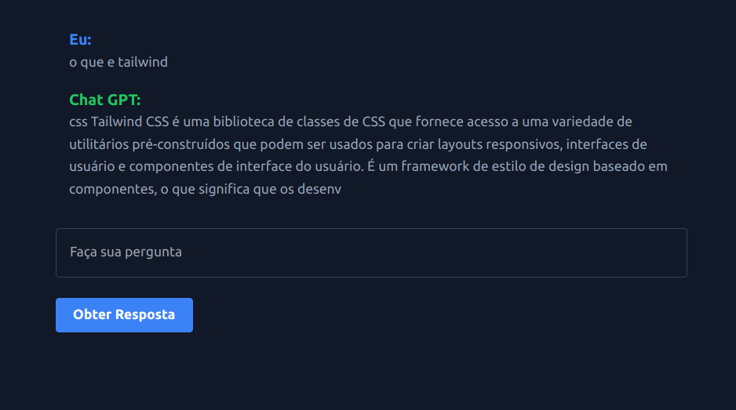

# Projetinho OpenAI

Construí uma aplicação simples usando HTML, TailwindCSS e JavaScript, onde faço perguntas e recebo respostas.

 

## Tecnologias

Abaixo as tecnologias usadas no proejto:

- HTML
- Tailwindcss
- Javascript
- API OPEN AI

 

